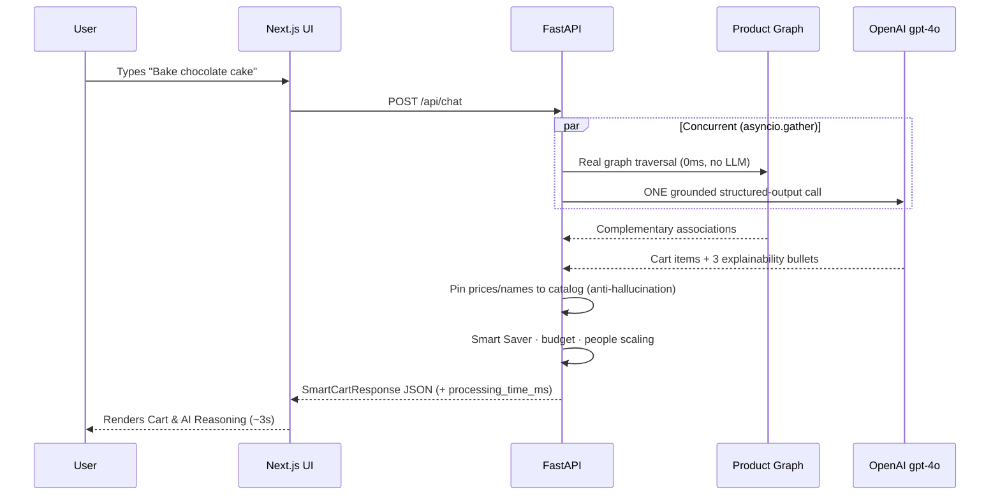
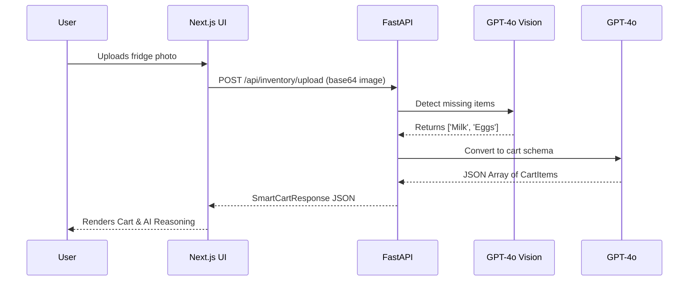

# Application Flow

## 1. User Journey: Natural Language Input

1. **User Input:** User types "I need to bake a chocolate cake right now" into the main input field.
2. **Frontend Request:** Next.js sends a POST request to FastAPI `/api/chat`.
3. **Single-Shot Synthesis (concurrent):**
   - **Product graph** (deterministic, 0ms) traverses real edges → `cake/baking → butter, flour, chocolate` associations.
   - **One grounded GPT-4o call** reasons over intent (`baking`), context (`evening`), real purchase history (e.g. prefers `Ghirardelli`), likely inventory gaps (`flour`), and the graph associations — then returns the cart + 3 explainability bullets in a single structured response.
4. **Post-Processing:** Every price and name is pinned to the catalog (anti-hallucination); Smart Saver discounts, budget fitting, and people-count scaling are applied deterministically.
5. **Backend Response:** FastAPI returns the structured JSON (+ `processing_time_ms`) to the frontend.
6. **UI Rendering & Checkout:** Frontend renders the Smart Cart with images, pricing, and AI reasoning; "1-Click Checkout" triggers the order tracking modal.

> **Why one call, not seven:** an earlier design chained 7 sequential agent calls (~60s). It was collapsed to 1 grounded call + graph (~3s) — for sub-5-minute Q-commerce sessions, latency is the product.

## 2. User Journey: Visual Inventory (Camera)

1. **User Input:** User clicks the camera icon and uploads a photo of an empty fridge shelf.
2. **Frontend Request:** Next.js sends a POST `multipart/form-data` request to `/api/inventory/upload`.
3. **Vision Analysis:** FastAPI sends the image to `gpt-4o` Vision, asking it to detect missing items.
4. **Cart Translation:** FastAPI sends the detected missing items to a secondary `gpt-4o` prompt to format them into a strict `CartItem` schema with mock prices.
5. **Backend Response:** Returns the `SmartCartResponse` to the frontend.
6. **UI Rendering & Checkout:** Identical to the text flow.
