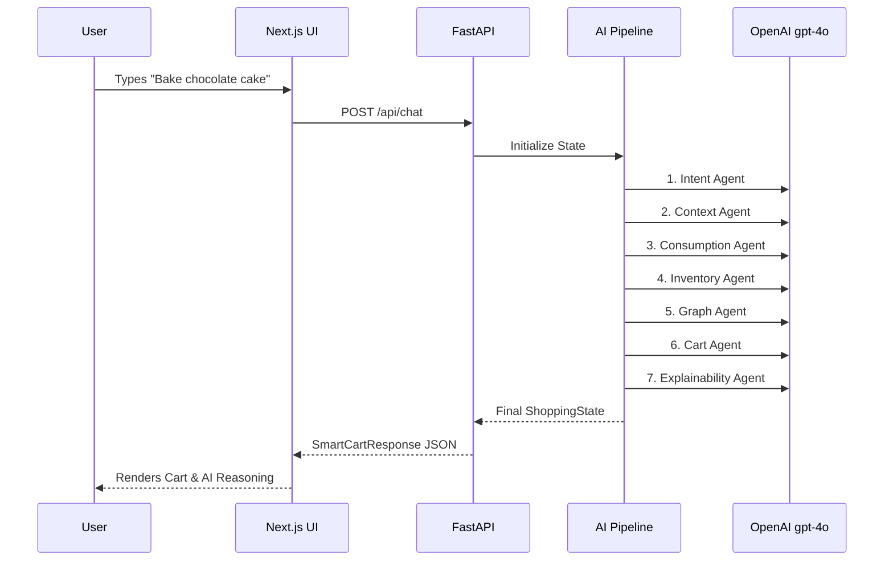
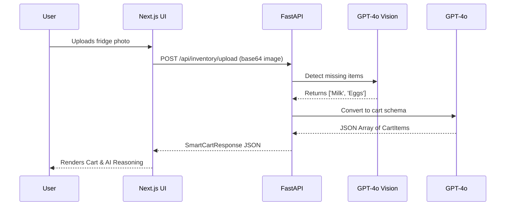

# Application Flow

## 1. User Journey: Natural Language Input

1. **User Input:** User types "I need to bake a chocolate cake right now" into the main input field.
2. **Frontend Request:** Next.js sends a POST request to FastAPI `/api/chat`.
3. **LangGraph Pipeline Triggered:**
   - **Intent Agent:** Classifies intent as `baking`.
   - **Context Agent:** Notes it is `evening` or `raining`.
   - **Consumption Agent:** Predicts preference for `Ghirardelli`.
   - **Inventory Agent:** Notes missing staple `Flour`.
   - **Graph Agent:** Associates `Cake` with `Butter`.
   - **Cart Agent:** Generates 3 items (Chocolate, Flour, Butter) with prices and reasoning.
   - **Explainability Agent:** Summarizes the AI thought process.
4. **Backend Response:** FastAPI returns the structured JSON to the frontend.
5. **UI Rendering:** Frontend renders the Smart Cart with item emojis, pricing, and AI Reasoning.
6. **Checkout:** User clicks "1-Click Checkout" triggering the order confirmation modal.

## 2. User Journey: Visual Inventory (Camera)

1. **User Input:** User clicks the camera icon and uploads a photo of an empty fridge shelf.
2. **Frontend Request:** Next.js sends a POST `multipart/form-data` request to `/api/inventory/upload`.
3. **Vision Analysis:** FastAPI sends the image to `gpt-4o` Vision, asking it to detect missing items.
4. **Cart Translation:** FastAPI sends the detected missing items to a secondary `gpt-4o` prompt to format them into a strict `CartItem` schema with mock prices.
5. **Backend Response:** Returns the `SmartCartResponse` to the frontend.
6. **UI Rendering & Checkout:** Identical to the text flow.
