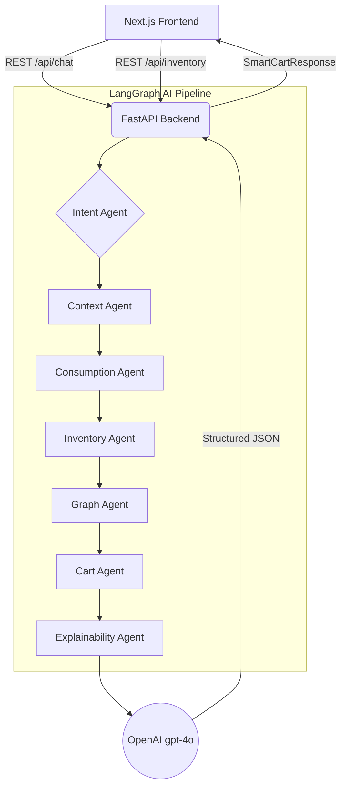
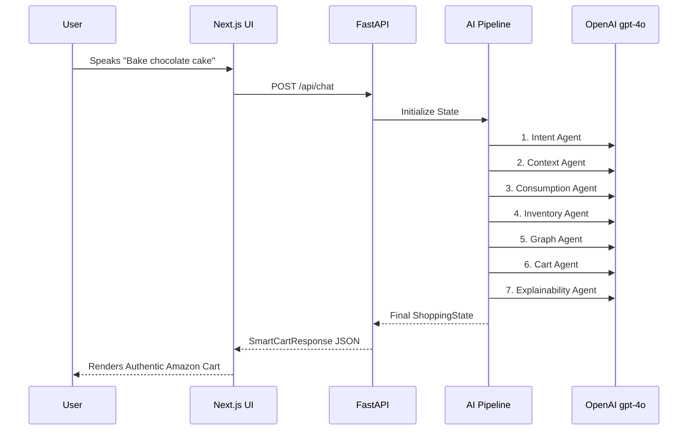
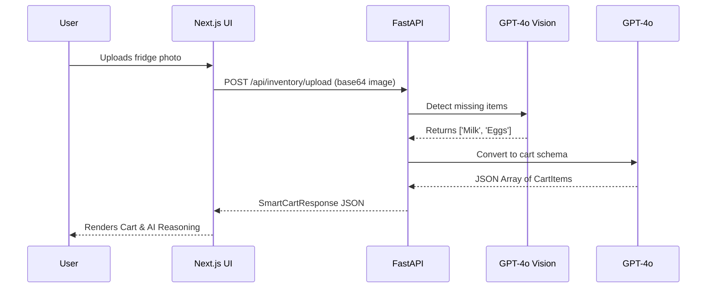
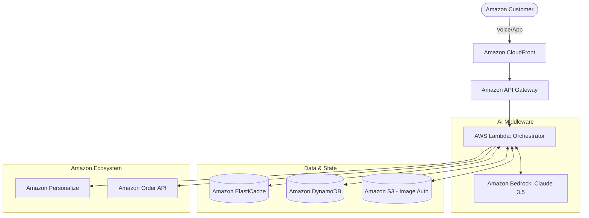

<div align="center">
  
  <h1>Amazon Now AI 🚀</h1>
  <p><strong>Reimagining Urgent Shopping. Need-Centric Commerce.</strong></p>
  <p>Transforming the 5-minute search-and-browse shopping experience into a 5-second need-fulfillment experience. Built for the Amazon Hackathon.</p>
</div>

<br />

## 📖 What is Amazon Now AI?
The current e-commerce paradigm is **Product-Centric** (User -> Search -> Browse -> Compare -> Add to Cart -> Checkout). This is highly inefficient for urgent needs. 

Quick-commerce customers want a **Need-Centric** flow (User expresses need -> System builds cart -> Checkout). **Amazon Now AI** uses a 7-agent LangGraph pipeline and GPT-4o Vision to instantly generate the perfect 3-item cart based on natural language or a photo of your empty fridge.

### 👤 The Customer Persona: Meet Priya
Priya is a busy working professional. It's 6:00 PM, and she just realized she has to host a last-minute dinner for 4 friends at 7:30 PM. 
- **The Old Way:** Priya opens an app, searches for pasta, compares 15 brands, adds to cart. Searches for sauce, compares 10 brands, adds to cart. Searches for drinks... *Time spent: 25 minutes.*
- **The Amazon Now Way:** Priya presses the mic and says, *"I'm hosting an Italian dinner for 4 people tonight."* The 7-agent AI instantly builds the perfect, complementary cart. *Time spent: 5 seconds.*

---

## ⚡ Features
- 🎙️ **Native Voice Search:** Speak your needs directly into the app using the Web Speech API.
- 📸 **Vision AI (VLM):** Upload a photo of your fridge, and the AI detects what's missing and adds it to your cart.
- 🤖 **7-Agent LangGraph Pipeline:** Advanced sequential orchestration ensuring accuracy, context, and semantic matching.
- ✨ **Authentic Amazon UX:** High-trust, conversion-optimized interface mirroring the classic Amazon shopping experience.
- 🚀 **1-Click Checkout:** Fake-order generation and tracking for immediate validation.

---

## 🔮 6-Month Futuristic Vision
As requested by the judging panel, here is how Amazon Now AI scales across the Amazon Ecosystem over the next 6 months:
1. **Alexa Smart Home Integration:** *"Alexa, look at my pantry camera and order what I need for breakfast tomorrow."*
2. **Amazon Personalize:** Feeding 5 years of user purchase history into the "Consumption Agent" to ensure brand loyalty (e.g., automatically knowing Priya prefers organic marinara).
3. **Amazon Prime Air (Drones):** Connecting the "Urgent Needs" Cart directly to autonomous drone dispatch for 15-minute fulfillment.
4. **Zoox Delivery:** For larger urgent orders, routing fulfillment through Zoox autonomous vehicles.

---

## 🏗️ Architecture & Flow Diagrams

### 1. The 7-Agent LangGraph Pipeline
Our core intelligence layer uses a directed acyclic graph to process intent and generate the cart.



### 2. User Journey: Natural Language / Voice


### 3. User Journey: Visual Camera Upload


### 4. Target Enterprise AWS Architecture
To deploy this at Amazon scale, we will migrate the entire stack to **AWS native services** (Amazon Bedrock, Lambda, ElastiCache).



---

## 💻 Tech Stack
- **Frontend:** Next.js (App Router), React, TailwindCSS, Lucide Icons, Web Speech API
- **Backend:** FastAPI, Python, Uvicorn
- **AI Middleware:** LangGraph, LangChain, OpenAI (`gpt-4o`)
- **Data Enforcement:** Pydantic (Strict JSON Structured Outputs)

---

## 🛠️ Local Setup

1. **Clone the repo**
   ```bash
   git clone https://github.com/CodeCraftsmanRohit/Amazon_NOW.git
   cd Amazon_NOW
   ```

2. **Setup Backend**
   ```bash
   python -m venv venv
   source venv/bin/activate  # On Windows: venv\Scripts\activate
   pip install -r requirements.txt
   ```

3. **Environment Variables**
   Copy `.env.example` to `.env` and add your OpenAI key:
   ```bash
   OPENAI_API_KEY=your_key_here
   ```

4. **Run Servers**
   ```bash
   # Terminal 1 (Backend)
   uvicorn backend.main:app --reload

   # Terminal 2 (Frontend)
   cd frontend
   npm install
   npm run dev
   ```

5. **Visit** `http://localhost:3000`

---
*Developed for the Amazon Hackathon by Rohit Kumar.*
