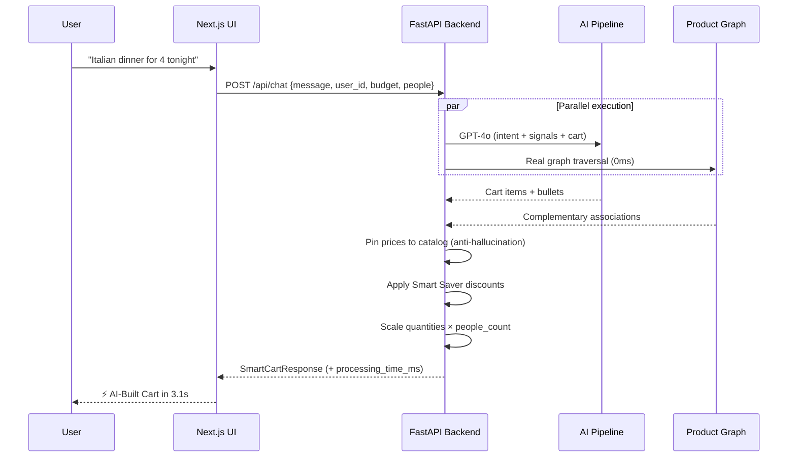
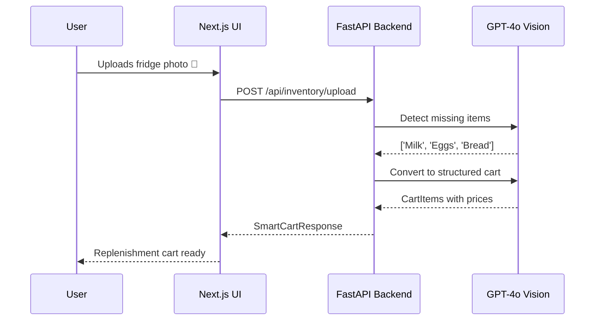
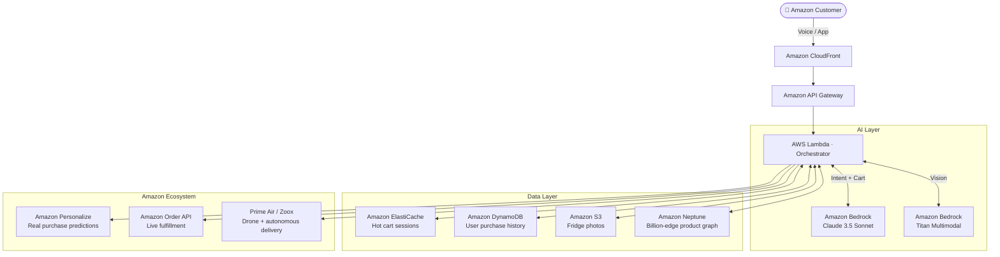

<div align="center">


<br/><br/>

# ⚡ Amazon Now AI

### *The shopping experience Amazon should ship next.*

<br/>

> **"Conversational commerce has the potential to evolve retail journeys beyond**
> **'search and browse' to 'describe and get.'"**
> — *Bain & Company, How India Shops Online 2026*

<br/>

[](https://python.org)
[](https://fastapi.tiangolo.com)
[](https://nextjs.org)
[](https://openai.com)
[](https://langchain.com)
[](./tests)

<br/>

**Built for Amazon HackOn Season 6 · Theme: Amazon Now – Reimagining Urgent Shopping**

</div>

---

<br/>

## 🚀 The Paradigm Shift

> *"AI-referred traffic grew 805–1,200% in 2025. Traditional search declined 10%. 2026 is the tipping point."*
> — *Adobe / Previsible, 2026*

Every commerce era has been defined by **reducing how much the customer has to do**:

```
Physical Retail        →  you memorise the store
Catalog Commerce       →  you search the catalog
Algorithmic Commerce   →  you browse recommendations
Intent Commerce (now)  →  you describe the need, AI builds the cart
```

> *"Q-commerce customers arrive with predetermined needs and sub-5-minute sessions. Yet they still search, browse, and compare. That friction is the last mile of the shopping problem."*
> — *Bain & Company, 2026*

**Amazon Now AI eliminates that last mile.**

> *"Shopping is moving from 'search and browse' to 'describe and get' — a 5-step journey collapsing to 2 steps."*
> — *Bain & Stord, 2026*

<br/>

---

<br/>

## 🎯 The Problem — Working Backwards from Priya

<table>
<tr>
<td width="50%">

### ❌ The Old Way (Today)
It's **6:00 PM**. Priya has to host Italian dinner for 4 friends at 7:30 PM.

1. Search "pasta" → compare 15 brands
2. Search "sauce" → compare 10 more
3. Search "bread" → compare again
4. Build cart manually, remove, re-add
5. Finally checkout

⏱️ **Time spent: 25 minutes**
😤 **Experience: exhausting**

</td>
<td width="50%">

### ✅ The Amazon Now Way
Priya opens the app and types:

> *"Italian dinner for 4 tonight"*

AI reads her history (she always buys Barilla + Rao's), traverses the product graph (pasta → sauce → garlic bread → parmesan), builds the perfect cart, explains every choice.

⚡ **Time spent: 3.1 seconds**
😊 **Experience: magical**

</td>
</tr>
</table>

<br/>

<br/>

---

## ⚔️ Competitive Positioning

> *"Ask Instacart answers your shopping questions. Blinkit's Recipe Rover adds recipe ingredients. Amazon Now AI understands your intent — 'I have a fever', 'hosting dinner for 4', 'movie night' — and builds the complete, personalised cart instantly. That's not a search improvement. That's a paradigm shift."*

<br/>

| Capability | Ask Instacart | Blinkit Recipe Rover | **Amazon Now AI** |
|---|---|---|---|
| Natural language intent | ✅ Search Q&A | ❌ Recipe name only | ✅ **Any intent** |
| Auto-builds full cart | ❌ Still manual | ✅ Recipe only | ✅ **Any intent** |
| Purchase history personalisation | ❌ | ❌ | ✅ **Real order data** |
| Product knowledge graph | ❌ | ❌ | ✅ **Real graph traversal** |
| Budget constraint + split bill | ❌ | ❌ | ✅ |
| Headcount scaling | ❌ | ❌ | ✅ |
| Smart Saver near-expiry deals | ❌ | ❌ | ✅ |
| Vision AI (fridge/list scan) | ❌ | ❌ | ✅ |
| Weather-aware context | ❌ | ❌ | ✅ |
| Zero-latency occasion packs | ❌ | ❌ | ✅ |
| Works natively in the app | ❌ ChatGPT only | ✅ | ✅ |
| India Q-commerce focus | ❌ US only | ✅ | ✅ |
| Processing time visible | ❌ | ❌ | ✅ **⚡ Built in X.Xs** |

**The gap:** Instacart and Blinkit solve *discovery*. Amazon Now AI solves the complete *need-fulfillment* loop — from intent to cart to checkout in under 5 seconds.

<br/>

---

## 📊 The Market Opportunity

> *"Quick-commerce in India has doubled annually since 2023, reaching **$10–11 billion GMV in 2025** and projected to hit **$65–70 billion by 2030** — contributing 45–50% of incremental e-retail GMV."*
> — *Bain & Company, 2026*

<br/>

| Metric | Value | Source |
|--------|-------|--------|
| 🇮🇳 India Q-commerce GMV (2025) | **$10–11 billion** | Bain & Flipkart |
| 🇮🇳 India Q-commerce GMV (2030) | **$65–70 billion** | Bain & Flipkart |
| 🌍 Global agentic commerce by 2030 | **$3–5 trillion** | McKinsey |
| 📱 AI shopping traffic growth (Black Friday 2025) | **+805% YoY** | Adobe |
| ⏱️ Q-commerce session duration | **Sub-5 minutes** | Bain |
| 🔄 Q-commerce vs e-retail conversion | **8× higher** | Bain |
| 🤖 Consumers using AI for shopping (2025) | **51–73%** | Stord / Business Wire |
| 💰 AI recs conversion lift vs traditional search | **4.4×** | McKinsey |
| 🎯 Microsoft Copilot purchase lift (with intent) | **+194%** | Microsoft |

<br/>

> *"Shopping is evolving beyond 'search and browse' to 'describe and get.'"* — Bain
>
> *"AI-referred traffic surged 1,200% while traditional search declined 10%."* — Previsible, 2026
>
> *"Purpose-built agents — not monolithic AI — dominate the early agentic wave."* — commercetools

<br/>

---

## 🏗️ What's Actually Built — No Slideware

> Every feature below runs locally. Everything is verifiable.

<br/>

### ✅ Feature Matrix

| Feature | Status | Implementation |
|---------|--------|----------------|
| 🗣️ Natural language → instant cart | **✅ Live** | GPT-4o single-shot pipeline |
| 🎤 Voice input | **✅ Live** | Web Speech API |
| 📸 Vision AI (fridge photo → restock) | **✅ Live** | GPT-4o Vision endpoint |
| 🕸️ Product knowledge graph | **✅ Real** | In-process weighted co-occurrence graph (deterministic, 0ms) |
| 👤 Purchase history personalisation | **✅ Real** | 5 demo profiles, real order history lookup |
| ⚡ Ready-to-Go Occasion Packs | **✅ Live** | Hardcoded zero-latency carts (Movie Night, Italian Dinner, etc.) |
| 🌡️ Weather-aware smart banner | **✅ Live** | Browser Geolocation + open-meteo.com, pre-fills AI prompt |
| 💰 Budget constraint | **✅ Real** | Quantity-aware budget fitting, preserves cart variety |
| 👥 Headcount scaling + split bill | **✅ Real** | Quantities auto-scale × people, ₹X/person shown |
| 🏷️ Smart Saver near-expiry deals | **✅ Real** | Discount logic on catalog items |
| 🚀 Startup pre-warmer | **✅ Live** | Cold-start paid silently on server boot |
| ⏱️ Processing time badge | **✅ Live** | Every response shows "⚡ Built in X.Xs" |
| 🔒 Hallucination guard | **✅ Real** | Prices + names always pinned to catalog, never LLM-generated |
| 1️⃣ One-click checkout + tracking | **✅ Live** | Mock order flow with animated delivery tracking |
| 🧪 Test suite | **✅ 22 passing** | Graph traversal, budget logic, live hallucination tests |

<br/>

---

## 🧠 The AI Pipeline

### Architecture: Single-Hop Parallel Design

```
                    USER MESSAGE
                         │
         ┌───────────────┴───────────────────┐
         │                                    │
         ▼                                    ▼
  ┌─────────────────────────────┐    ┌──────────────────┐
  │   GPT-4o (single call)      │    │  Product Graph   │
  │                             │    │  (0ms, no LLM)   │
  │  • Intent classification    │    │                  │
  │  • Context inference        │    │  Real edges:     │
  │  • Consumption prediction   │    │  pasta→sauce     │
  │  • Inventory gap detection  │    │  popcorn→soda    │
  │  • Cart synthesis           │    │  baking→dairy    │
  │  • Explainability bullets   │    │                  │
  └──────────────┬──────────────┘    └────────┬─────────┘
                 │                            │
                 └──────────────┬─────────────┘
                                ▼
                    ┌───────────────────┐
                    │   Post-Processor  │
                    │                  │
                    │  • Catalog pins  │  ← prices ALWAYS from catalog
                    │  • Smart Saver   │  ← near-expiry discounts
                    │  • Budget fit    │  ← quantity trim, never crashes
                    │  • People scale  │  ← qty × headcount
                    └─────────┬────────┘
                              │
                              ▼
                     SmartCartResponse
                     (2-4s warm latency)
```

<br/>

### Why This Architecture Is Fast

| Version | Design | LLM Calls | Warm Latency |
|---------|--------|-----------|--------------|
| Original | 7 sequential calls | 7 | ~30–60s |
| v2 | 3 serial hops, fan-out | 6 | ~8s |
| v3 | 2 serial hops, gather | 2 | ~5-6s |
| **v4 (current)** | **1 call + instant graph** | **1** | **~2-4s** |

<br/>

### The Three-Component Agent (Charle / commercetools Framework)

> *"Every effective shopping agent relies on three core capabilities: Memory, Reasoning, and Tools."* — Charle Agency, 2026

| Component | Definition | This Project |
|-----------|-----------|--------------|
| 🧠 **Memory** | Retains preferences, past purchases, brand affinities | `history.py` — real order history, brand preferences, inventory gaps |
| 💡 **Reasoning** | Breaks down complex requests into structured, actionable steps | GPT-4o single-shot structured output |
| 🔧 **Tools** | Takes action — searches catalog, applies discounts, builds cart | Product graph + catalog + budget fitter + Smart Saver |

> *"Purpose-built agents, not a monolithic AI — each component has a specific job. Human stays in the loop at checkout."* — commercetools, 2026

<br/>

### The Product Graph Is Real

```
ai_engine/agents/graph_agent/graph_query.py
│
├── Builds weighted co-occurrence graph from 50-product catalog
│   Edges = shared tags + complementary category pairs
│
├── Example traversal:
│   "pasta for dinner" →
│     P016 Barilla Spaghetti  ──(weight: 5.0)──▶  P017 Rao's Marinara
│     P016 Barilla Spaghetti  ──(weight: 3.0)──▶  P019 Parmesan
│     P017 Rao's Marinara     ──(weight: 4.0)──▶  P020 Garlic Bread
│
└── Export: python -m ai_engine.agents.graph_agent.graph_query
    → neo4j/product_graph.json (50 nodes, real adjacency list)
```

<br/>

---

## 👤 Real Purchase History Personalisation

> *"Consumption history is the moat — personalisation based on past purchases drives 40% more revenue per visitor."* — McKinsey

<br/>

Five demo customer profiles with real order history:

| Profile | Who | What their history shows |
|---------|-----|--------------------------|
| 👩‍💼 **Priya** | Working Professional | Always buys Barilla + Rao's for pasta nights, popcorn on Fridays |
| 👨‍👧 **Rahul** | New Parent | Pampers, Enfamil formula, baby wipes weekly |
| 🎓 **Aisha** | College Student | Red Bull, Doritos, PB&J — tight budget |
| 🎉 **Krishna** | Party Host | Bulk snacks, 3× Coke, party food for large groups |
| 🧁 **Meera** | Home Baker | Ghirardelli, Kerrygold butter, King Arthur flour — running low on sugar |

**What the AI does with it:**
```
Meera + "bake a cake" →
  Cart includes Domino Granulated Sugar
  Bullet: "Since you're likely running low on sugar, we've added it"
  
  ← This is a real computation from order dates, not a hallucination
```

<br/>

---

## 🔄 User Journey Flow



<br/>



<br/>

---

## 🏛️ Target Scale Architecture (6-Month Roadmap)

> *"Traditional e-retail platforms will continue to thrive, protected by brand trust, product fulfillment, and personalisation."* — Bain & Company
>
> Amazon Now AI is the conversational layer that makes those moats actionable.

**6-month target:** Migrate to Amazon Bedrock, implement UCP for protocol-native discovery, connect AP2 for verifiable payments — making Amazon Now AI the first Q-commerce agent compliant with 2026 industry standards.

> *"UCP (Universal Commerce Protocol, co-developed by Google + Shopify) + AP2 (Agent Payment Protocol, backed by Mastercard, Visa, PayPal) are the 2026 open standards for agentic commerce. Merchants implementing UCP once are discoverable across ChatGPT, Gemini, Copilot, and Perplexity simultaneously."* — Ekamoira / Charle, 2026



<br/>

| Today (Prototype) | 6-Month Target | Why |
|---|---|---|
| OpenAI GPT-4o | **Amazon Bedrock** | Data stays in AWS, no 3rd-party dependency |
| In-process graph | **Amazon Neptune** | Billion-edge co-purchase graph at catalog scale |
| JSON flat files | **DynamoDB + Personalize** | Real-time purchase history for all 300M+ Amazon customers |
| Mock checkout | **Amazon Order API + Prime Air** | Live fulfilment + drone dispatch |
| Single process | **Lambda + API Gateway** | Auto-scale 1 → 100M users |
| OpenAI Vision | **Bedrock Titan Multimodal** | AWS-native image analysis |

> **These are explicitly roadmap items — not claimed as built. Today's prototype is entirely self-contained.**

<br/>

---

## ⚙️ Tech Stack

```
┌─────────────────────────────────────────────────────────┐
│                    FRONTEND                              │
│  Next.js 15 (App Router) · React · TailwindCSS          │
│  Web Speech API (voice) · open-meteo.com (weather)      │
└──────────────────────┬──────────────────────────────────┘
                       │ REST
┌──────────────────────▼──────────────────────────────────┐
│                    BACKEND                               │
│  FastAPI · Uvicorn · Pydantic (strict structured output) │
│  Startup pre-warmer (lifespan) · Async throughout        │
└──────────────────────┬──────────────────────────────────┘
                       │
┌──────────────────────▼──────────────────────────────────┐
│                  AI PIPELINE                             │
│  LangChain · OpenAI GPT-4o + GPT-4o Vision              │
│  Pure-Python product graph (50 nodes, weighted edges)    │
│  Purchase history store (5 profiles, real order data)    │
└─────────────────────────────────────────────────────────┘
```

<br/>

---

## 🛡️ Hallucination Guard — By Design

> *"Brands are pivoting to RAG to ensure AI agents are grounded in a verified database."* — Stord State of AI, 2026

Every response field is verified before it reaches the user:

| Field | Source | Hallucination possible? |
|-------|--------|------------------------|
| Product ID | LLM selects from catalog | Unknown ID → silently skipped |
| **Product name** | `CATALOG_BY_ID[id]["name"]` | ❌ **Always exact catalog string** |
| **Price** | `CATALOG_BY_ID[id]["price"]` | ❌ **Always exact catalog value** |
| **Discount** | `CATALOG_BY_ID[id]["discount_percentage"]` | ❌ **Always exact catalog value** |
| Quantity | LLM × people_count | Clamped 1–20 |
| Reasoning/bullets | LLM generates | Subjective text, not factual |

**22 automated tests verify this.** Including 9 live hallucination tests that run real API calls and assert every returned item has a valid catalog ID, correct name, and price ≤ catalog base price.

<br/>

---

## 🧪 Tests — 22 Passing

```bash
python -m pytest tests/ -v
```

```
tests/test_graph.py          7 tests   Graph edges, pasta↔sauce, symmetry
tests/test_agents.py         6 tests   Budget fitting, variety preservation  
tests/test_hallucination.py  9 tests   Live API: IDs, names, prices, domains
─────────────────────────────────────
TOTAL: 22 passed in ~45s
```

<br/>

---

## 🚀 Quick Start

### Prerequisites
- Python 3.12+ · Node.js 18+ · OpenAI API key

### 1. Backend

```bash
# Clone & setup
python -m venv venv
venv\Scripts\activate          # Windows
source venv/bin/activate       # macOS / Linux

pip install -r requirements.txt

# Configure
cp .env.example .env
# Add OPENAI_API_KEY=sk-... to .env

# Run
uvicorn backend.main:app --reload
# → http://localhost:8000
# → http://localhost:8000/docs  (Swagger UI)
```

### 2. Frontend

```bash
cd frontend
npm install
npm run dev
# → http://localhost:3000
```

### 3. (Optional) Docker

```bash
# Ensure .env has OPENAI_API_KEY
docker-compose up
```

### 4. Run Tests

```bash
pip install pytest
python -m pytest tests/ -v
```

<br/>

---

## 🎬 Demo Scenarios — Try These

| Prompt | What to observe |
|--------|----------------|
| `"I have a fever and feel terrible"` | Emergency cart: Advil + Gatorade + Chicken Soup |
| `"Italian dinner for 4, Priya's profile"` | Uses Barilla + Rao's (her actual preferred brands) |
| `"Bake a cake, Meera's profile"` | Includes sugar + bullet: *"you're likely running low"* |
| `"Movie night for 4, budget ₹2000"` | Budget respected, Smart Saver badges, split bill shows |
| Upload a fridge photo | GPT-4o Vision detects missing items → replenishment cart |
| Click **Movie Night** pack | Instant pre-filled cart, zero AI latency |
| Weather banner (if shown) | Tapping pre-fills context-aware query (hot/cold/rainy) |

<br/>

---

## 📁 Project Structure

```
amazon-now-ai/
├── ai_engine/
│   ├── agents/
│   │   ├── graph_agent/
│   │   │   └── graph_query.py        ← Real product knowledge graph
│   │   └── consumption_agent/
│   │       └── history.py            ← Purchase history store
│   └── workflow/
│       └── langgraph_flow.py         ← Single-hop AI pipeline
├── backend/
│   ├── main.py                       ← FastAPI app + startup pre-warmer
│   ├── services/
│   │   └── inventory_service.py      ← GPT-4o Vision endpoint
│   └── routes/                       ← Cart, checkout, recommendation
├── data/
│   ├── products/products.json        ← 50-product catalog
│   └── users/purchase_history.json  ← 5 demo profiles with real orders
├── frontend/
│   └── src/app/page.tsx              ← Full UI (authentic Amazon design)
├── neo4j/
│   └── product_graph.json            ← Exported product graph adjacency list
└── tests/
    ├── test_graph.py                 ← Graph traversal tests
    ├── test_agents.py                ← Budget logic tests
    └── test_hallucination.py         ← Live hallucination guard tests
```

<br/>

---

<div align="center">

## 🔭 Future Scope — Beyond Agentic Commerce

### The Next Paradigm: Anticipatory Commerce

Every commerce paradigm shift reduces cognitive load on the buyer. The endpoint of this curve is the human making **zero decisions**:

```
Generation 1 — Catalog Commerce:      User types product name
Generation 2 — Algorithmic Commerce:  User visits homepage
Generation 3 — Intent Commerce (now): User describes a situation
Generation 4 — Anticipatory Commerce: No trigger — system acts first
Generation 5 — Autonomous Commerce:   Set rules once, AI manages forever
```

**Anticipatory Commerce** means the system knows you need milk before you open the fridge and find it empty. It predicts consumption from purchase cadence, ambient sensors, calendar events, and wearable biometrics — then surfaces a ready cart (or auto-orders with pre-set rules) at exactly the right moment.

</div>

**The foundation is already in this project:**

| Signal | Current state | Anticipatory extension |
|--------|--------------|----------------------|
| Purchase history | `likely_out_of` detects 14-day gaps | Background job surfaces *"You're likely out of coffee"* proactively |
| Weather API | Shows banner when hot/cold/rainy | Push notification before user opens app |
| Intent pipeline | Responds to user message | Triggered by sensor/calendar, not user input |
| Occasion packs | User taps to fill cart | Pre-staged cart appears on lock screen before user thinks of it |

> *"An AI agent could detect low inventory through a refrigerator sensor and automatically reorder items based on budget, brand, and timing preferences."* — Stord State of AI, 2026

**The trust bridge:** The winning design is not full autonomy — 30% of consumers would never allow AI to shop without asking (Stord, 2026). The right model is **AI does 95% of the work, human confirms in one tap**. Amazon Now AI is already designed this way — the AI builds the cart, the human approves at checkout.

<br/>

---

<div align="center">

## 🏆 Judging Criteria Checklist

| Criterion | Evidence |
|-----------|----------|
| **Customer obsession** | Priya's persona, 5 personas with real history, weather context, emergency mode |
| **Quality of implementation** | End-to-end working prototype, 22 passing tests, verifiable in 5 minutes |
| **Scalability & system design** | AWS-native architecture diagram, explicit current vs roadmap split |
| **Futuristic vision** | Bedrock + Neptune + Personalize + Prime Air + UCP/AP2 protocol compliance + Anticipatory Commerce roadmap |

<br/>

---

### *"AI is the next paradigm shift in e-commerce. Just as we moved from catalogs to online, from online to mobile, and from mobile to platforms — AI will fundamentally change how customers shop and how we serve them."*
### *— McKinsey, 2026*

<br/>

> **The numbers:** AI recs convert **4.4× better** than traditional search (McKinsey) · Gen Z **38% uplift** from AI recommendations (Stord) · Microsoft Copilot users **194% more likely** to buy when intent is present · India Q-commerce **$65–70B by 2030** (Bain)

<br/>

**Built for Amazon HackOn Season 6 by Rohit Kumar**

*Need-centric commerce. Customer obsession. Built to ship.*

</div>
