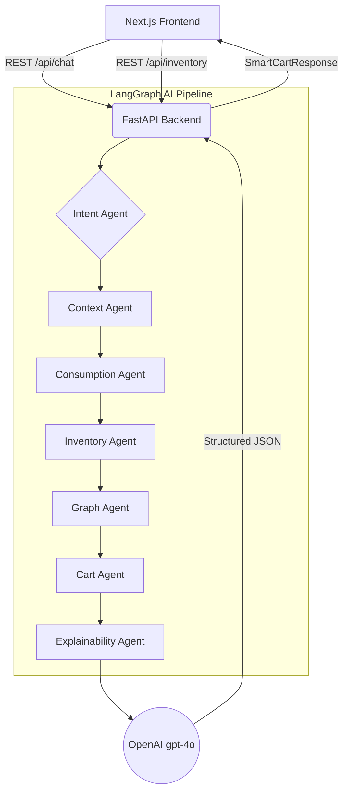

# Amazon Now AI: System Design & Architecture

## 1. Current Hackathon Architecture (Prototype)
Our current 48-hour prototype uses a lightweight stack optimized for speed and a working demo:

- **Frontend:** Next.js (React), TailwindCSS
- **Backend:** FastAPI (Python)
- **AI Orchestration:** LangGraph (State Graph for 7 dynamic agents)
- **LLM Provider:** OpenAI `gpt-4o` (for text and vision)
- **Deployment:** Localhost

## 2. Target Enterprise Architecture (AWS-Native)
To deploy this at Amazon scale (millions of users, sub-second latency), we will migrate the entire stack to **AWS native services**. This guarantees enterprise security, massive horizontal scalability, and deep integration with the Amazon ecosystem.

### Key AWS Components:
- **Amazon Bedrock (Claude 3.5 Sonnet / Titan Multimodal):** 
  Replacing OpenAI with Amazon Bedrock ensures our data never leaves the AWS ecosystem. Bedrock provides serverless, highly scalable access to top-tier foundation models with built-in security and low latency.
- **AWS Lambda & API Gateway:**
  The FastAPI backend and LangGraph agents will be deployed as serverless Lambda functions behind API Gateway to handle massive traffic spikes seamlessly.
- **Amazon ElastiCache (Redis):**
  Used to cache user sessions, contexts, and frequent graph queries, dramatically reducing latency for the Cart and Context agents.
- **Amazon DynamoDB:**
  A highly scalable NoSQL database to store user purchase histories, feeding directly into the Consumption Agent.
- **Amazon Personalize:**
  Integrates directly with the Consumption Agent to provide hyper-accurate purchase predictions based on the user's historical Amazon data.
- **Amazon S3:**
  For secure storage and processing of user-uploaded fridge/pantry images.

### 3. Scalability & Security
By leveraging Amazon Bedrock and AWS Serverless infrastructure, the system can auto-scale from 1 user to 100 million without provisioning servers. Bedrock guarantees that customer conversational data and images are not used to train base models, preserving customer trust and privacy.
