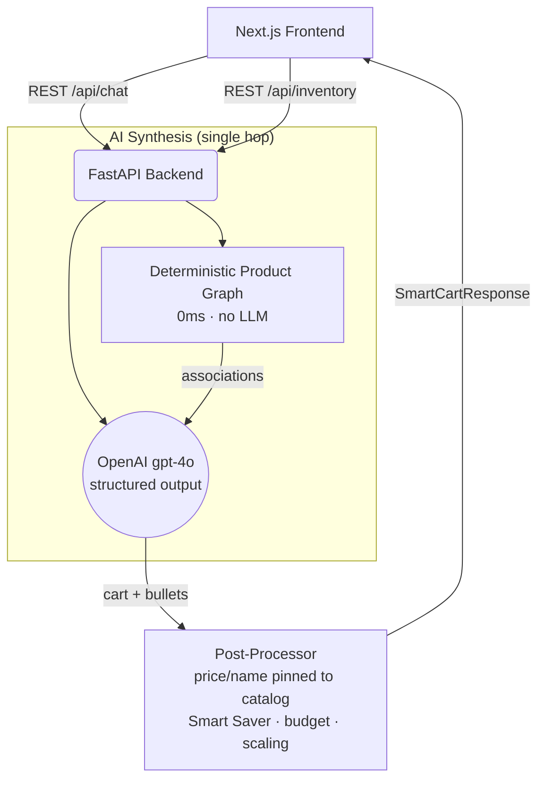
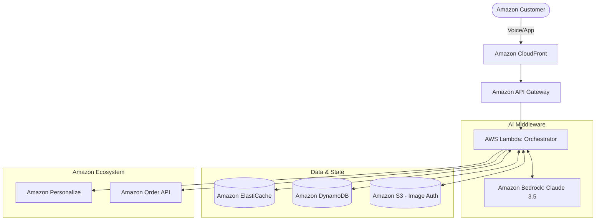

# Amazon Now AI: System Design & Architecture

## 1. Current Hackathon Architecture (Prototype)
Our 48-hour prototype uses a lightweight stack optimised for speed and a working demo. The core is a **single-shot synthesis**: one grounded GPT-4o call handles intent, context, history, inventory reasoning, cart selection and explainability at once, running concurrently with a deterministic in-process product association graph.

- **Frontend:** Next.js (React), TailwindCSS
- **Backend:** FastAPI (Python), async throughout
- **AI:** One grounded GPT-4o structured-output call + an in-process weighted product association graph (pure Python, deterministic)
- **Provider layer:** model-agnostic (`ai_engine/llm/provider.py`) — OpenAI default, Amazon Bedrock one env-var away
- **Anti-hallucination:** post-processor pins every price/name to the catalog
- **Deployment:** Localhost

> **Design history:** started at 7 sequential agent calls (~60s), deliberately collapsed to 1 grounded call + graph (~3s). For sub-5-minute Q-commerce sessions, latency is the product.

## 2. Target Enterprise Architecture (AWS-Native)
To deploy this at Amazon scale (millions of users, sub-second latency), we will migrate the entire stack to **AWS native services**. This guarantees enterprise security, massive horizontal scalability, and deep integration with the Amazon ecosystem.

### Key AWS Components:
- **Amazon Bedrock (Claude 3.5 Sonnet / Titan Multimodal):** 
  Replacing OpenAI with Amazon Bedrock ensures our data never leaves the AWS ecosystem. Bedrock provides serverless, highly scalable access to top-tier foundation models with built-in security and low latency.
- **AWS Lambda & API Gateway:**
  The FastAPI backend and AI synthesis call will be deployed as serverless Lambda functions behind API Gateway to handle massive traffic spikes seamlessly.
- **Amazon ElastiCache (Redis):**
  Used to cache user sessions, contexts, and frequent graph queries, dramatically reducing latency.
- **Amazon DynamoDB:**
  A highly scalable NoSQL database to store user purchase histories, feeding the personalisation layer.
- **Amazon Personalize:**
  Provides hyper-accurate purchase predictions based on the user's historical Amazon data.
- **Amazon S3:**
  For secure storage and processing of user-uploaded fridge/pantry images.

### 3. Scalability & Security
By leveraging Amazon Bedrock and AWS Serverless infrastructure, the system can auto-scale from 1 user to 100 million without provisioning servers. Bedrock guarantees that customer conversational data and images are not used to train base models, preserving customer trust and privacy.
